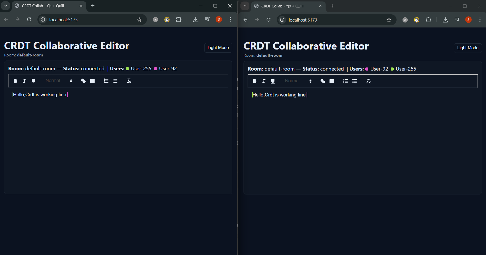

# CRDT Collaborative Editor

> A real-time collaborative text editor built with **React, Quill, and Yjs**.
> Implements **CRDT principles** (Conflict-Free Replicated Data Types) to ensure **strong eventual consistency**, inspired by academic research.
> Demonstrates multi-user collaboration with shared cursors, awareness, persistence, and automated convergence testing.

---

##  Features

* 📝 **Rich text editing** with [Quill](https://quilljs.com/)
* 🔄 **Conflict-free sync** powered by [Yjs](https://yjs.dev/)
* 👥 **Multi-user awareness** with colored cursors (`quill-cursors`)
* 💾 **Local persistence** (IndexedDB) + **server snapshots** (file storage)
* 🌗 **Dark/Light mode toggle**
* ✅ **Convergence test scripts** proving strong eventual consistency
* 🔌 **WebSocket relay server** (`y-websocket`) for real-time message passing

---

##  Architecture

```text
[ Client A ]      [ Client B ]
   |                  |
   |   CRDT Updates   |
   v                  v
+---------------------------+
|   y-websocket Relay       |  <-- relay only
+---------------------------+
   ^                  ^
   |   CRDT Updates   |
   |                  |
[ Client C ]      [ Client D ]

- Y.Doc (CRDT) maintained in each client
- WebsocketProvider syncs state between clients
- Awareness protocol broadcasts presence (user, cursor, selection)
- File snapshots ensure persistence across restarts
```

---

## Getting Started

### 1. Clone and install

```bash
git clone https://github.com/your-username/crdt-collaborative-editor.git
cd crdt-collaborative-editor
```

Install **server**:

```bash
cd server
npm install
```

Install **client**:

```bash
cd ../client
npm install --legacy-peer-deps
```

---

### 2. Run server

```bash
cd server
npm start
```

Server runs at `ws://localhost:1234`

---

### 3. Run client

```bash
cd client
npm run dev
```

Client runs at `http://localhost:5173`

---

### 4. Test convergence (research proof)

```bash
node convergence_test.js
```

Expected output:

```
=== Yjs concurrent insert test ===
doc1: AAA-BBB-
doc2: AAA-BBB-
equal: true

=== Yjs offline merge test ===
final r1: World-Hello-
final r2: World-Hello-
equal: true
```

Confirms **Strong Eventual Consistency** (SEC).

---

##  Screenshots

Two users editing in real-time:



---

##  Research Context

This project implements concepts from distributed systems literature:

* **Strong Eventual Consistency (SEC):** all replicas converge without central coordination.
* **Awareness & Presence:** lightweight protocol for cursor sharing and user presence.
* **Persistence & Recovery:** snapshotting ensures durability and disaster recovery.

 Referenced Paper:

* Iovescu, R., & Tudose, D. (2024). *Real-Time Document Collaboration—System Architecture and Design*. Applied Sciences, 14(18), 8356. [MDPI](https://www.mdpi.com/2959110)

---

##  Future Improvements

* 📊 Benchmark update size, latency (p50/p90), metadata growth.
* 🔀 Implement a toy CRDT (Logoot or RGA) for side-by-side comparison.
* 🔐 Add authentication & room access control.
* 🌐 Try peer-to-peer sync (`y-webrtc`) instead of server relay.
* 🕹️ Automated Puppeteer demo for simultaneous typing proof.

---

##  Contributing

Contributions welcome! Fork the repo, open an issue, or submit a PR.
This project is intended as a **learning + research prototype**, not production software.

---

## 📜 License

MIT License © 2025 Suhani Tyagi
